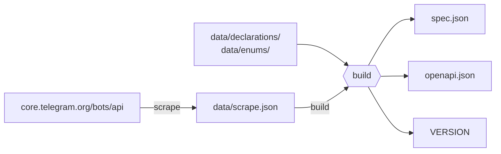

# telegram-bot-api-schema

The complete Telegram Bot API, as machine-readable data. Not just the tables of
types and methods — also the escaping rules, the limits, the constraints and the
conventions that every library otherwise hard-codes by hand.

[](https://core.telegram.org/bots/api)
[](https://core.telegram.org/bots/api#august-24-2026)
[](LICENSE)

```
https://raw.githubusercontent.com/DOFER998/telegram-bot-api-schema/main/spec.json
```

- [What is in it](#what-is-in-it)
- [What the data looks like](#what-the-data-looks-like)
- [Compared to other specifications](#compared-to-other-specifications)
- [Using it](#using-it)
- [OpenAPI](#openapi)
- [Files](#files)
- [How it works](#how-it-works)

## What is in it

**5 836 facts about Bot API 10.3.**

| | |
| --- | --- |
| Types | 400 |
| Methods | 185 |
| Fields and parameters | 2 820 |
| Enums / values | 37 / 358 |
| Abstract-type links | 388 |
| Facts extracted from field prose | 878 |
| Facts stated outside the tables | 397 |
| Notes attached to entities | 15 |
| Changelog entries | 101 |

The last three rows are the point. Other specifications carry the tables. This
one also carries what the documentation says *around* them.

| Section | Holds |
| --- | --- |
| `types`, `methods` | The tables, in the shape the ecosystem already uses |
| `enums` | 37 value sets, 24 derived from the discriminators of abstract types |
| `fields` | What each field's prose states: ranges, defaults, alphabets, constants |
| `document.formatting` | Escaping rules, tag inventories, entity nesting, date-time format |
| `document.sending_files` | The three ways to send a file, with every size ceiling |
| `document.colors` | Both accent palettes, 21 and 16 entries, light and dark |
| `document.command_scopes` | The ordered search that decides which commands a user sees |
| `document.transport` | URL template, content types, response envelope |
| `document.conventions` | Integer width, token shape, update delivery, editing rules |
| `document.articles` | Every prose section of the page, verbatim |
| `changelog` | Telegram's own release notes, structured |

## What the data looks like

<details>
<summary><b>A type with fields</b> — <code>types.Dice</code></summary>

```json
{
  "name": "Dice",
  "href": "https://core.telegram.org/bots/api#dice",
  "description": ["This object represents an animated emoji that displays a random value."],
  "fields": [
    {
      "name": "emoji",
      "types": ["String"],
      "required": true,
      "description": "Emoji on which the dice throw animation is based",
      "html_description": "Emoji on which the dice throw animation is based"
    },
    {
      "name": "value",
      "types": ["Integer"],
      "required": true,
      "description": "Value of the dice, 1-6 for “🎲”, “🎯” and “🎳” base emoji, 1-5 for “🏀” and “⚽” base emoji, 1-64 for “🎰” base emoji",
      "html_description": "Value of the dice, 1-6 for “”, …"
    }
  ]
}
```

`html_description` is kept beside every description because Telegram marks values
up with emphasis and `<code>`. Strip the tags and a value becomes an ordinary
word.

</details>

<details>
<summary><b>A method with a return type</b> — <code>methods.getChatMemberCount</code></summary>

```json
{
  "name": "getChatMemberCount",
  "href": "https://core.telegram.org/bots/api#getchatmembercount",
  "description": ["Use this method to get the number of members in a chat. Returns Integer on success."],
  "returns": ["Integer"],
  "fields": [
    {
      "name": "chat_id",
      "types": ["Integer", "String"],
      "required": true,
      "description": "Unique identifier for the target chat or username of the target supergroup or channel in the format @username",
      "html_description": "Unique identifier for the target chat or username of the target supergroup or channel in the format <code>@username</code>"
    }
  ]
}
```

Return types are parsed out of prose, since the documentation never structures
them. Seven methods whose result depends on the message kind carry a declared
override instead.

</details>

<details>
<summary><b>An enum, whole</b> — <code>enums.PollType</code></summary>

```json
{
  "name": "PollType",
  "description": "Kinds of poll.",
  "href": "https://core.telegram.org/bots/api#poll",
  "values": ["regular", "quiz"],
  "members": ["Regular", "Quiz"],
  "applies_to": ["Poll.type", "sendPoll.type"]
}
```

`applies_to` names every field this enum types, so a generator can point them at
one shared type. `members` gives an identifier-safe name per value — six dice
emoji contain no character an identifier may hold, so no consumer could derive
them.

</details>

<details>
<summary><b>An abstract type</b> — <code>types.MenuButton</code></summary>

```json
{
  "name": "MenuButton",
  "href": "https://core.telegram.org/bots/api#menubutton",
  "description": ["This object describes the bot's menu button in a private chat. It should be one of"],
  "subtypes": ["MenuButtonCommands", "MenuButtonWebApp", "MenuButtonDefault"],
  "notes": [
    {
      "position": "after_table",
      "tag": "p",
      "text": "If a menu button other than MenuButtonDefault is set for a private chat, then it is applied in the chat. Otherwise the default menu button is applied. By default, the menu button opens the list of bot commands."
    }
  ]
}
```

Each subtype carries `subtype_of` pointing back. The documentation states the
relation only downwards; the upward link is derived so a consumer holding one
case does not have to walk every abstract type to find its parent.

</details>

<details>
<summary><b>Field constraints</b> — <code>fields</code>, keyed by <code>Entity.field</code></summary>

```json
"setWebhook.secret_token": {
  "entity": "setWebhook",
  "field": "secret_token",
  "on": "method",
  "min_length": 1,
  "max_length": 256,
  "alphabet": { "ranges": ["A-Z", "a-z", "0-9"], "characters": ["_", "-"] }
}
```

```json
"getUpdates.limit": {
  "entity": "getUpdates",
  "field": "limit",
  "on": "method",
  "min": 1,
  "max": 100,
  "default": 100
}
```

Both were read out of sentences: *"1-256 characters. Only characters `A-Z`,
`a-z`, `0-9`, `_` and `-` are allowed."* and *"Values between 1-100 are accepted.
Defaults to 100."*

</details>

<details>
<summary><b>Escaping rules</b> — <code>document.formatting.modes.MarkdownV2.escaping</code></summary>

```json
{
  "escape_character": "\\",
  "escapable_codes": { "from": 1, "to": 126 },
  "always": ["_", "*", "[", "]", "(", ")", "~", "`", ">", "#", "+", "-", "=", "|", "{", "}", ".", "!"],
  "contexts": [
    { "inside": "pre and code entities", "characters": ["`", "\\"] },
    { "inside": "the (...) part of the inline link and custom emoji definition", "characters": [")", "\\"] }
  ],
  "ambiguity": {
    "sequence": "__",
    "resolved_as": "underline",
    "separator": "**",
    "text": "In case of ambiguity between italic and underline entities __ is always greedily treated from left to right as beginning or end of an underline entity, so instead of ___italic underline___ use ___italic underline_**__, adding an empty bold entity as a separator."
  }
}
```

This is the part every library reimplements from memory. Getting it wrong
produces messages Telegram rejects for reasons the bot author cannot see.

</details>

## Compared to other specifications

| | Types & methods | Enums | Constraints | Prose | Bot API | Format |
| --- | --- | --- | --- | --- | --- | --- |
| **this** | yes | 37 | 878 facts | 397 facts | 10.3 | JSON + OpenAPI 3.1 |
| [PaulSonOfLars](https://github.com/PaulSonOfLars/telegram-bot-api-spec) | yes | — | — | — | current | JSON |
| [marksto](https://github.com/marksto/clj-tg-bot-api) | yes | — | — | — | current | EDN / Malli |
| [ark0f](https://github.com/ark0f/tg-bot-api) | yes | some | some | — | 8.3 | OpenAPI 3.0 |

Fair notes on each:

- **PaulSonOfLars** is the de-facto standard, kept current, and the shape most
  tools already read. `types` and `methods` here use the same field names on
  purpose, so moving over costs nothing.
- **marksto** ships a Malli schema, which is more useful than JSON if you are
  writing Clojure — it validates directly. It lives inside a client library.
- **ark0f** was the only OpenAPI option and models return types well. It is on
  Bot API 8.3; the parser's last commit was November 2024, while its deploy keeps
  publishing.

## Using it

<details open>
<summary>TypeScript — walk the methods</summary>

```ts
const spec = await fetch(
  'https://raw.githubusercontent.com/DOFER998/telegram-bot-api-schema/main/spec.json',
).then((r) => r.json());

for (const method of Object.values(spec.methods)) {
  const required = (method.fields ?? []).filter((f) => f.required).map((f) => f.name);
  console.log(`${method.name}(${required.join(', ')}) -> ${method.returns.join(' | ')}`);
}
// sendMessage(chat_id, text) -> Message
// getChatMemberCount(chat_id) -> Integer
```

</details>

<details>
<summary>Python — read an enum and a field's constraints</summary>

```python
import json, urllib.request

url = "https://raw.githubusercontent.com/DOFER998/telegram-bot-api-schema/main/spec.json"
spec = json.load(urllib.request.urlopen(url))

action = spec["enums"]["ChatAction"]
print(dict(zip(action["members"], action["values"])))
# {'Typing': 'typing', 'UploadPhoto': 'upload_photo', ...}

limit = spec["fields"]["getUpdates.limit"]
print(limit["min"], limit["max"], limit["default"])
# 1 100 100
```

</details>

<details>
<summary>Go — validate a value before sending it</summary>

```go
// spec.Fields is map[string]Field, keyed "Entity.field"
f := spec.Fields["setWebhook.secret_token"]

if len(token) < f.MinLength || len(token) > f.MaxLength {
    return fmt.Errorf("secret_token must be %d-%d characters", f.MinLength, f.MaxLength)
}
```

</details>

`schema.json` is a JSON Schema for `spec.json` itself, so you can generate types
for the specification and read it with autocompletion.

## OpenAPI

`openapi.json` describes the same API as an OpenAPI 3.1 document — 185 paths,
439 schemas — for tooling that reads OpenAPI, and for generating clients.

What it is good for:

| Use | Why it works |
| --- | --- |
| Tooling that reads OpenAPI | API clients, gateways, mock servers — 3.1 support varies by tool |
| Request validation | Every constraint is a real keyword, so a validator enforces it |
| Reference documentation | Renderers such as Redoc and Scalar take 3.1 directly |
| Your own code generation | 185 operations and 439 schemas, already structured |

Constraints become real keywords: `minimum`, `maxLength`, `pattern`, `enum`,
`const`, `format: int64`. Abstract types become `oneOf` with a `discriminator`
and a full value-to-schema mapping. Everything OpenAPI has no field for rides
along in `x-telegram-*` extensions — nothing is dropped.

> [!IMPORTANT]
> **Every operation answers with an envelope, not with the value.** Bot API
> wraps each result in `{ok, result, description, error_code}`, so that is what
> the document describes — and what any tool built from it will hand you.
> Unwrapping is the caller's job.

> [!WARNING]
> **Generator output quality varies a lot, and the generator version matters.**
> On openapi-generator 7.11.0 nothing compiled; on 7.25.0 the TypeScript and
> Python clients build clean. Use a current generator.

### Generator results

Measured with openapi-generator **7.25.0** on Bot API 10.3.

| Language | Generates | Compiles | `x-enum-varnames` | Notes |
| --- | --- | --- | --- | --- |
| `typescript-fetch` | yes | **clean** | honoured | 651 files, `tsc --noEmit` silent |
| `python` | yes | **clean** | honoured | byte-compiles; runtime deps not installed here |
| `java` | yes | 2 files fail | honoured | see below — one field, one generator bug |
| `go` | yes | 10 errors | honoured | enum members collide with type names |
| `csharp` | yes | not checked | honoured | generator targets .NET 10, local SDK is 8.0 |
| `rust` | yes | not checked | honoured | no `cargo` on the machine that measured this |
| `kotlin` | yes | not checked | honoured | no `kotlinc` on the machine that measured this |
| `php` | yes | not checked | honoured | no `php` on the machine that measured this |

<details>
<summary>What still fails, and why it is not fixed here</summary>

Both remaining failures are generator bugs. Each was isolated by rebuilding the
document without the construct and re-measuring.

**Java — two files.** The generator declares `UpdateType` with the names this
specification supplies (`Message("message")`) and then references the same enum
in a default value using its own convention (`UpdateType.MESSAGE`). Only
`allowed_updates` carries a default of enum values, so only `WebhookInfo` and
`GetUpdatesRequest` fail.

**Go — ten collisions.** `ContentType.Animation` and the type `Animation` land at
package scope together, and the generator does not prefix enum constants.
Removing `x-enum-varnames` does not help: Go then emits syntax errors from the
dice emoji instead. There is no document that satisfies this generator.

Enums reached through `$ref` used to break several generators; inlining them
would have taken C# on 7.11.0 from 64 errors to 12. It is not done, and 7.25.0
no longer needs it: `applies_to` exists so that forty fields share one
`ParseMode` type rather than carrying forty copies.

</details>

<details>
<summary>What was changed in the document because of this</summary>

Boolean `const` was removed from the OpenAPI projection. A field typed `True` in
the documentation was written as `{"type": "boolean", "const": true}` — literally
correct JSON Schema. Two generators turned a boolean `const` into a single-member
enum backed by an int or a string and emitted code that did not compile; on
7.11.0 dropping it took C# from 338 errors to 64.

Nothing was lost: the fact is carried by `x-telegram-always` on the schema, and
for fields also by `x-telegram-boolean.type_column`. `spec.json` is unchanged —
this is a choice about the OpenAPI projection, whose only job is to be fed to a
generator.

</details>

<details>
<summary>What a generated call actually looks like (typescript-fetch)</summary>

```ts
// Note the return type: an envelope, named after another method that
// happens to share the same shape.
async sendMessage(
  requestParameters: SendMessageOperationRequest,
  initOverrides?: RequestInit,
): Promise<EditMessageChecklist200Response> {
  const response = await this.sendMessageRaw(requestParameters, initOverrides);
  return await response.value();
}

// And the envelope you get back:
export interface EditMessageChecklist200Response {
  ok: EditMessageChecklist200ResponseOkEnum;
  result?: Message;
  description?: string;
  errorCode?: number;
  parameters?: ResponseParameters;
}
```

Calling it:

```ts
const envelope = await api.sendMessage({
  sendMessageRequest: { chatId: 123456, text: 'hello' },
});
if (!envelope.ok) throw new Error(envelope.description);
const message = envelope.result;
```

</details>

If you are writing the client yourself, `spec.json` is the better input: it has
everything `openapi.json` has, plus the prose sections, and none of the shapes
forced on it by OpenAPI.

## Files

| File | What it is |
| --- | --- |
| [`spec.json`](spec.json) | Everything, in this repository's own format |
| [`openapi.json`](openapi.json) | The same API as OpenAPI 3.1 |
| [`schema.json`](schema.json) | JSON Schema describing `spec.json` |
| [`VERSION`](VERSION) | Bot API version and release date, shell-readable |

```
https://raw.githubusercontent.com/DOFER998/telegram-bot-api-schema/main/spec.json
https://raw.githubusercontent.com/DOFER998/telegram-bot-api-schema/main/openapi.json
https://raw.githubusercontent.com/DOFER998/telegram-bot-api-schema/main/schema.json
https://raw.githubusercontent.com/DOFER998/telegram-bot-api-schema/main/VERSION
```

> [!NOTE]
> These four names will never be renamed. A raw GitHub URL has no redirect, so a
> rename would break every consumer at once and silently.

### Versioning

A release is tagged `v10.3.0`: major and minor from the Bot API, patch ours for a
correction made while the Bot API version stays put.

> [!CAUTION]
> **The version is not semver and a minor bump can break you.** `10.2` → `10.3`
> is whatever Telegram did, which may include removing a field. Pin a tag if you
> want to adopt changes deliberately:
>
> ```
> https://raw.githubusercontent.com/DOFER998/telegram-bot-api-schema/v10.3.0/spec.json
> ```

## How it works

A nightly job reads the documentation page, rebuilds everything and compares it
with what is committed. If nothing moved it exits quietly. If something moved it
opens a pull request listing what was added, removed and changed, alongside
Telegram's own release notes.



The scrape captures structure and interprets nothing. The build is what turns a
paragraph into a rule, because that is the step that can silently stop working.

<details>
<summary><b>Why the build fails instead of writing less</b></summary>

Reading prose means regular expressions, and a regular expression that stops
matching produces no error. The category empties, the build succeeds, and the
output still looks fine.

Three mechanisms prevent that:

| Mechanism | What it catches |
| --- | --- |
| `data/expectations.json` | A category falling more than a fifth below the last accepted build |
| Required probes | A number stated once in prose that a pattern no longer finds |
| Collision detection | Two patterns reading the same digits, so one reports the other's number |

Under all of it, `document.articles` keeps every prose section verbatim, so what
no extractor reads yet is still in the file.

</details>

<details>
<summary><b>Why parse5 is the only dependency</b></summary>

The documentation page is invalid HTML in seven places — `<a href="x"><a
href="x">…</a></a>`. A conformant HTML5 tree builder repairs those. Bun's
built-in HTMLRewriter is a token stream and hands the malformed nesting back.

Both were implemented and measured. The streaming version needed a hand-written
entity decoder and a hand-written slice of the HTML5 nesting rules to produce the
same bytes. `parse5` is a devDependency, so no consumer ever sees it — consumers
fetch a JSON file.

</details>

<details>
<summary><b>Working on it</b></summary>

```
bun install
bun run scrape          # the page into data/scrape.json
bun run build           # spec.json, openapi.json and VERSION
bun run check           # schema, internal references, OpenAPI, published URLs
bun run update          # what the nightly job runs
bun run scrape:verify   # one download, two parses, compared
bun run build:verify    # one scrape, two builds, compared
```

`data/` holds the scrape, 48 declarations for facts the page does not state, and
13 enum strategies. The other 24 enums derive themselves.

When extraction genuinely falls — Telegram removed something — record the new
floor with `bun run build --accept`, which leaves a diff somebody signed off on.

</details>

## License

[MIT](LICENSE) for the code and for the way this data is assembled and shaped.

The Bot API itself is Telegram's, and so is the documentation every fact here
was read from. This licence covers the machinery and the format, not Telegram's
right to the underlying material.
